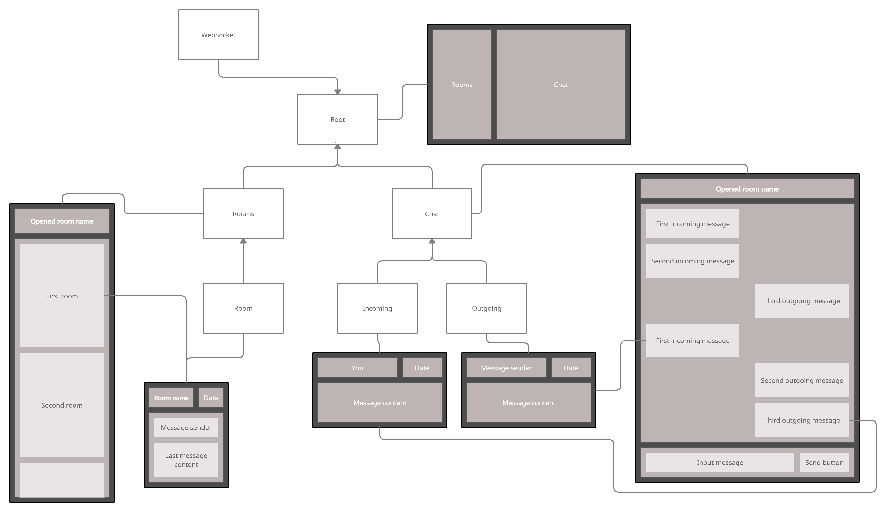

# Innonymous Web client

> NOTE: this repo is a part of project, see [full README](https://github.com/innonymous/compose) first

#### Web implementation of Innonymous chat


## Architecture brief view

Below you can find UML/Design diagram of React containers and web UI boxes


<p align="center">

</p>

## Install and run

1. Install `node` and `npm`. [Guide](https://docs.npmjs.com/downloading-and-installing-node-js-and-npm)

```sh
$ node -v       
v16.3.0
$ npm -v       
7.17.0
```

2. Configure `.env` file:

```
REACT_APP_API_URL=https://innonymous.tk/api/
```

3. Install depencencies and run frontend!

```
$ npm install
$ npm start
```


Done! Frontend is avaliable at http://localhost:8080
